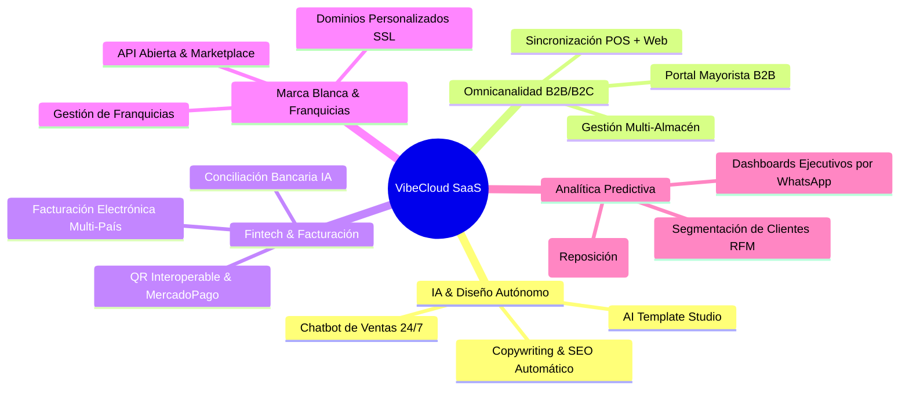

# 🚀 VibeCloud Enterprise SaaS — Hoja de Ruta de Expansión & Trabajos Futuros (Roadmap 2026-2028)

Este documento maestro define la visión estratégica y el plan de evolución técnica para **VibeCloud Enterprise SaaS**, marcando el camino hacia el liderazgo absoluto en sistemas de Punto de Venta (POS) minoristas/mayoristas, E-Commerce adaptativo y soluciones Marca Blanca en América Latina y el mundo.

---

## 🌐 Visión General del Ecosistema
VibeCloud se consolida como una plataforma **Omnicanal, Inteligente y Multi-Tenant**, donde la Inteligencia Artificial no es un adorno, sino el núcleo operativo que automatiza el diseño, las ventas, el stock y las finanzas de cada negocio suscrito.

---

## 📅 Fases de Implementación y Módulos de Expansión

### 🤖 Fase 1: Inteligencia Artificial Autónoma & Diseño Creativo (En Desarrollo)
*Objetivo: Dotar a cada comercio de un equipo de diseño, marketing y atención al cliente impulsado 100% por IA.*

* [ ] **VibeCloud AI Template Studio (`/admin/ai-studio`)**:
  * Constructor visual de plantillas en tiempo real donde el usuario diseña su tienda e-commerce mediante órdenes en lenguaje natural (ej: *"Quiero un tema minimalista estilo Apple Store con tonos salvia y bordes curvos"*).
  * Generación dinámica de tokens CSS/JSON e inyección instantánea al DOM sin recargar la página.
  * Publicación en 1 clic y biblioteca personal de temas guardados en base de datos.
* [ ] **Generador de Catálogos y SEO Automático (Gemini AI)**:
  * Redacción automática de descripciones persuasivas, títulos optimizados para SEO y palabras clave a partir del nombre o foto del producto.
  * Creación de banners publicitarios promocionales para días festivos (CyberMonday, Navidad, Día de la Madre).
* [ ] **Asistente Virtual de Ventas & Soporte 24/7 (Chatbot Omnicanal)**:
  * Agente conversacional integrado en la tienda web, WhatsApp e Instagram que responde consultas de stock, recomienda productos según el historial del cliente y cierra ventas.

---

### 🛒 Fase 2: E-Commerce Avanzado & Omnicanalidad Total
*Objetivo: Romper la barrera entre la tienda física y el mundo digital, sincronizando inventarios, precios y logística al segundo.*

* [ ] **Sincronización en Tiempo Real (POS Físico + Tienda Online)**:
  * Bloqueo instantáneo de stock en la web cuando se escanea un código de barras en el mostrador físico (y viceversa) mediante WebSockets / Redis.
* [ ] **Portal Mayorista B2B de Autoservicio**:
  * Área exclusiva para clientes mayoristas con inicio de sesión de empresa.
  * Listas de precios por escalafón de volumen, cotizaciones automáticas en PDF, pedidos en borrador y gestión de líneas de crédito / cuenta corriente.
* [ ] **Logística y Gestión Multi-Almacén**:
  * Soporte para múltiples sucursales y depósitos.
  * Ruteo inteligente de envíos: asignación automática del pedido a la sucursal más cercana al domicilio del cliente.

---

### 💳 Fase 3: Fintech, Pagos Integrados & Facturación Multi-País
*Objetivo: Convertir a VibeCloud en el centro financiero del comercio, eliminando tareas administrativas manuales.*

* [ ] **Pasarelas de Pago Nativas & QR Interoperable**:
  * Integración directa con MercadoPago, Stripe, MODO, Getnet y Transferencias 3.0 (QR interoperable en mostrador y web).
  * Soporte para links de pago por WhatsApp y cobros recurrentes (suscripciones de clientes).
* [ ] **Motor de Facturación Electrónica Nativa (Latam & USA)**:
  * Conexión directa y acreditada con los organismos fiscales sin requerir intermediarios costosos:
    * **Argentina**: AFIP / ARCA (Facturas A, B, C, Notas de Crédito, MiPyME).
    * **Chile**: SII (Servicio de Impuestos Internos).
    * **México**: SAT (CFDI 4.0).
    * **Colombia**: DIAN (Facturación Electrónica y Nómina).
    * **Perú**: SUNAT.
* [ ] **Conciliación Bancaria y Flujo de Caja con IA**:
  * Lectura automática de extractos bancarios y conciliación con los tickets emitidos en el POS.
  * Alertas automáticas de descubiertos o desviaciones de caja.

---

### 🏢 Fase 4: Expansión SaaS Multi-Tenant & Marca Blanca (White-Label)
*Objetivo: Escalar el modelo corporativo para cadenas comerciales, franquicias y revendedores de software.*

* [ ] **Dominios Propios con SSL Automático (`mitienda.com`)**:
  * Configuración DNS automatizada mediante Cloudflare API / Render para que cada tenant tenga su propio dominio exclusivo con certificado de seguridad SSL gestionado por VibeCloud.
* [ ] **Gestión Jerárquica de Franquicias y Cadenas**:
  * Panel "Casa Central / Master Franchise" con visión unificada de ventas de todas las sucursales o franquiciados.
  * Control centralizado de catálogo de productos, listas de precios sugeridas y cálculo automático de regalías mensuales.
* [ ] **Marketplace de Extensiones & API Abierta**:
  * Webhooks y API REST pública documentada con Swagger/OpenAPI para que desarrolladores de terceros conecten ERPs (SAP, Oracle, Odoo), CRMs (Salesforce, HubSpot) o sistemas de fidelización.

---

### 📊 Fase 5: Big Data & Analítica Predictiva (Business Intelligence)
*Objetivo: Transformar datos de ventas en decisiones ejecutivas automáticas que aumenten la rentabilidad.*

* [ ] **Predicción de Quiebre de Stock (AI Inventory Forecasting)**:
  * Algoritmos de machine learning que analizan la velocidad de venta histórica, estacionalidad y tiempos de entrega de proveedores para generar órdenes de compra automáticas antes de quedarse sin mercadería.
* [ ] **Segmentación Inteligente de Clientes (Matriz RFM)**:
  * Clasificación automática de clientes en: *Campeones, Fieles, en Riesgo, Dormidos*.
  * Disparo automático de cupones de descuento por email/WhatsApp para recuperar clientes en riesgo de abandono.
* [ ] **Reportes Ejecutivos Matutinos por WhatsApp (Daily Vibe Report)**:
  * Cada mañana a las 8:00 AM, el dueño del negocio recibe un mensaje de WhatsApp autogenerado por la IA con el resumen ejecutivo del día anterior: *Ventas totales, ticket promedio, producto estrella, margen de ganancia y alertas de stock*.

---

## ⚙️ Estándares de Arquitectura y Escalabilidad Futura

Para soportar esta expansión sin comprometer la velocidad ni la estabilidad, mantendremos los siguientes pilares de ingeniería:

1. **Desacoplamiento Total (Microservicios & API-First)**: Mantener la separación limpia entre el motor de base de datos/backend (`FastAPI + SQLAlchemy`), el e-commerce (`Medusa V2 + Next.js`) y las colas de trabajo asincrónicas (`Redis + Celery/ARQ`).
2. **Seguridad y Aislamiento por Tenant (`tenant_id`)**: Garantizar que todas las consultas a la base de datos estén estrictamente filtradas por el identificador de la organización para evitar cualquier cruce de datos en el SaaS.
3. **Optimización de Costos de Nube (Render / AWS / Cloudflare)**: Uso de builds estáticos pre-renderizados en el Frontend, caché distribuida en Redis y compresión de imágenes al vuelo para mantener costos operativos bajos incluso con miles de tiendas activas.

---
*Documento mantenido por el equipo de ingeniería y arquitectura de VibeCloud Enterprise SaaS.*
